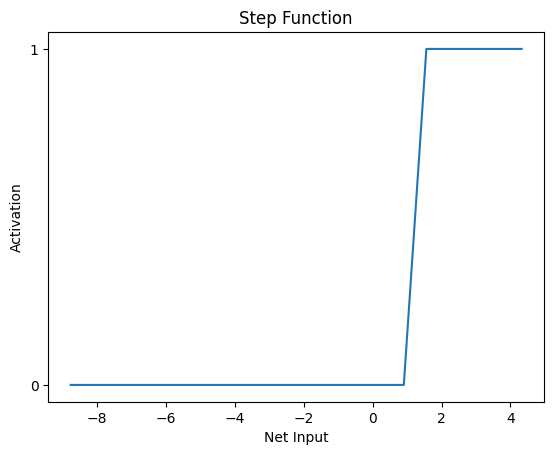

# Ann Perceptrons

This project implements artificial neural networks (ANN) using perceptrons as per the ANN university subject.

0. [Sum Function](#0-sum-function)
1. [Single Layer](#1-single-layer-perceptron)
2. Single Layer and Training
3. Multi Layer

## 0. Sum Function
    The sum_function is designed to compute the sum of the products of corresponding elements from two lists: inputs and weights. This is a common operation in neural networks, particularly in the calculation of the net input to a neuron.

```python
def sum_function(inputs, weights) -> float:
    '''
    Sum of the product of the inputs by the weights

    @return float: The Net Input / Pre-Activation result 
    '''

    ...
```

## 1. Single Layer Perceptron
    In this section, we implement a simple step function, which is often used in academic settings to illustrate the basic principles of neural networks and perceptrons.

```python
def step_function(net_input) -> int:
    '''
    1, if net_input >= 1
    0, if net_input < 1
    
    @return int: The Activation result
    '''
    
    ...
```
> The following chart is made using both the `Sum` and `Step` functions


